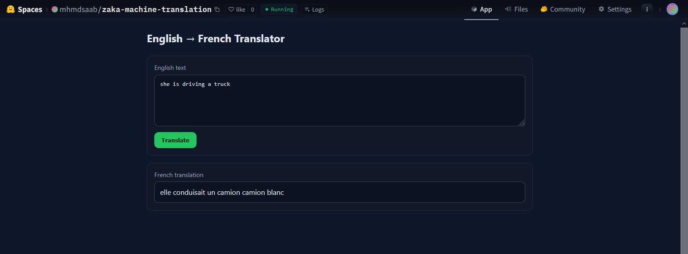

# 🇬🇧➡️🇫🇷 English to French Machine Translation  

This project is a simple **Neural Machine Translation app** built with **TensorFlow + Flask**.  
It takes an English sentence as input and returns its French translation.  

The app is deployed on **Hugging Face Spaces** with a lightweight web interface.  
https://huggingface.co/spaces/mhmdsaab/zaka-machine-translation

---

## Features  
- Sequence-to-sequence GRU model trained on English–French pairs  
- Flask backend API + HTML/CSS/JS interface  
- Supports Docker for local deployment  
- Responsive UI for easy testing  

---


## 🛠️ Setup Instructions (Local with Docker)  

1. Clone the repository:  
   ```bash
   git clone https://github.com/mhmdsaab7/MachineTranslation.git
   cd MachineTranslation
2. Build the Docker image:
    ```bash
   docker build -t engfr-translator .
3. Run the container:
   ``` bash
   docker run -p 8080:8080 engfr-translator
4. Open in your browser:
    ```bash
   http://localhost:8080

---- 
## Using the Interface

Enter an English sentence in the text box.

Click Translate.

The French translation will appear instantly below.

---

## Known Issues / Limitations
* The model vocabulary is limited to training data → may fail on rare/long sentences.

* Currently only supports English → French, not bidirectional translation.

* Model used is not perfect and can be optimized specially by adding attention mechanism

---
### App Screenshot


